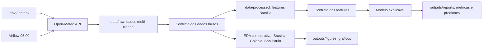

# 01 - Arquitetura Logica

## Visao geral

A arquitetura foi estruturada para sustentar execucao local, atualizacao diaria e auditoria dos artefatos.

## Fontes de dados

Fonte definida: Open-Meteo Historical Weather API.

Caracteristicas:

- acesso via HTTPS;
- chave de API opcional no `.env`;
- dados historicos por coordenada;
- granularidade diaria;
- formato JSON na extracao e CSV no armazenamento local;
- variaveis de temperatura, precipitacao, vento e umidade.

## Integracao

A integracao multi-cidade coleta Brasilia, Goiania e Sao Paulo, grava CSVs individuais em `data/raw` e cria um consolidado em `data/raw/weather_multi_city_daily.csv`.

## Modelo de dados

Entidades logicas:

- `weather_daily_observation`: observacao meteorologica diaria por cidade;
- `rain_prediction_feature`: linha supervisionada de Brasilia;
- `weather_city_comparison`: resumo exploratorio entre cidades;
- `rain_model_report`: metricas e interpretacao do modelo;
- `airflow_dag_run`: execucao operacional diaria.

## Armazenamento

- `data/raw`: dados brutos;
- `data/processed`: features;
- `outputs/reports`: relatorios, predicoes e resumos;
- `outputs/figures`: graficos de EDA;
- `outputs/models`: modelo treinado;
- `airflow/dags`: orquestracao diaria.
