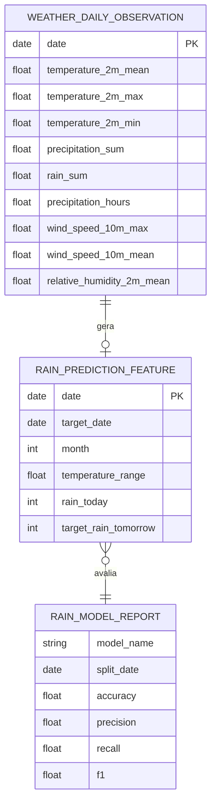

# 03 - Modelo de Dados

## Dicionario de dados

| Campo | Tipo esperado | Obrigatorio | Regra de qualidade | Observacao |
| --- | --- | --- | --- | --- |
| `date` | data ISO | Sim | Unica na base bruta | Dia usado como origem da feature |
| `target_date` | data ISO | Sim | Nao nula | Dia seguinte previsto |
| `month` | inteiro | Sim | 1 a 12 | Captura sazonalidade |
| `temperature_2m_mean` | decimal | Sim | Numerico | Temperatura media do dia |
| `temperature_range` | decimal | Sim | Numerico | Maxima menos minima |
| `precipitation_sum` | decimal | Sim | Numerico | Precipitacao do dia atual |
| `rain_sum` | decimal | Sim | Numerico | Chuva do dia atual |
| `precipitation_hours` | decimal | Sim | Numerico | Horas com precipitacao |
| `wind_speed_10m_max` | decimal | Sim | Numerico | Vento maximo |
| `wind_speed_10m_mean` | decimal | Sim | Numerico | Vento medio |
| `relative_humidity_2m_mean` | decimal | Sim | Numerico | Umidade media |
| `rain_today` | binario | Sim | 0 ou 1 | 1 quando choveu pelo menos 1 mm no dia |
| `target_rain_tomorrow` | binario | Sim | 0 ou 1 | Alvo do modelo |

## Regras de qualidade

Regras implementadas no codigo:

- presenca de colunas obrigatorias;
- valores obrigatorios nao vazios;
- conversao de colunas numericas;
- unicidade por coluna-chave;
- contagem de registros validados;
- geracao de relatorio estruturado.

## Modelo entidade-relacionamento

