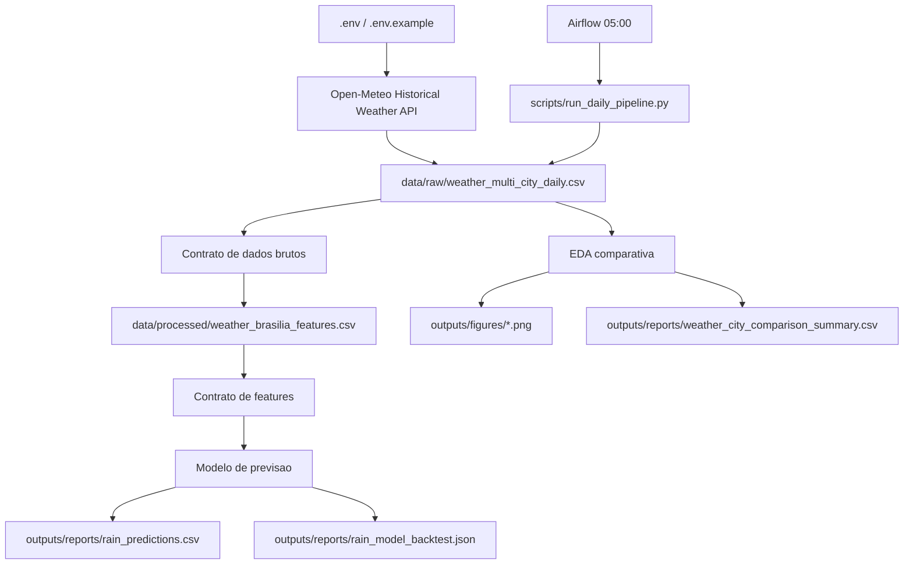

# Predicao Chuvas Brasilia

[](https://github.com/Innecco/Projeto-Integrador-I/actions/workflows/ci.yml)

Projeto de engenharia de dados e machine learning para estimar a ocorrencia de chuva no dia seguinte em Brasilia, com coleta automatizada da Open-Meteo, validacao de contratos, analise exploratoria comparativa e orquestracao diaria por Airflow.

Repositorio GitHub: [Innecco/Projeto-Integrador-I](https://github.com/Innecco/Projeto-Integrador-I/tree/main)

## Visao Geral

A solucao foi organizada para ser reprodutivel, auditavel e adequada para publicacao em repositorio publico. O pipeline executa:

1. coleta historica da Open-Meteo;
2. consolidacao de Brasilia, Goiania e Sao Paulo;
3. validacao dos dados brutos por contrato;
4. construcao da base supervisionada de Brasilia;
5. validacao das features;
6. geracao de graficos de analise exploratoria;
7. treinamento e avaliacao temporal do modelo;
8. escrita de predicoes e relatorios;
9. execucao diaria por Airflow as 05:00.

## Arquitetura



## Fonte de Dados

Fonte: [Open-Meteo Historical Weather API](https://open-meteo.com/en/docs/historical-weather-api)

A Open-Meteo nao exige chave para uso nao comercial. O projeto mantem `OPEN_METEO_API_KEY` no `.env` para suportar evolucoes futuras sem alterar codigo-fonte.

| Cidade | Papel no projeto |
| --- | --- |
| Brasilia | Cidade-alvo do modelo de previsao |
| Goiania | Comparacao regional |
| Sao Paulo | Comparacao climatica |

## Estrutura

```text
Projeto Integrador 1/
|-- .github/workflows/ci.yml
|-- .env.example
|-- airflow/
|   `-- dags/
|-- config/
|-- data/
|   |-- external/
|   |-- interim/
|   |-- processed/
|   `-- raw/
|-- docs/
|-- modelo/
|-- outputs/
|   |-- figures/
|   |-- models/
|   `-- reports/
|-- scripts/
|-- src/
|   `-- projeto_integrador/
|-- tests/
|-- docker-compose.airflow.yml
|-- requirements-airflow.txt
`-- requirements-core.txt
```

## Instalacao Local

Pre-requisitos para execucao local:

- Windows com PowerShell;
- Python 3.12 ou superior;
- internet ativa para coleta da API.

Preparar o ambiente virtual:

```powershell
powershell -ExecutionPolicy Bypass -File scripts/setup_venv.ps1
```

Criar `.env` a partir do modelo, se necessario:

```powershell
Copy-Item .env.example .env
```

Executar o pipeline completo:

```powershell
.venv\Scripts\python.exe scripts\run_daily_pipeline.py
```

Executar testes automatizados:

```powershell
.venv\Scripts\python.exe -m unittest discover -s tests
```

Executar validacao de publicacao local:

```powershell
powershell -ExecutionPolicy Bypass -File scripts/github_release_check.ps1
```

## Airflow com Docker

Pre-requisitos para Airflow:

- Docker Desktop instalado;
- Docker Compose disponivel;
- Docker Desktop em execucao;
- WSL2 operacional no Windows;
- virtualizacao habilitada no firmware da maquina;
- porta `8080` livre.

Validar ambiente:

```powershell
powershell -ExecutionPolicy Bypass -File scripts/preflight_airflow.ps1
```

Subir Airflow:

```powershell
docker compose -f docker-compose.airflow.yml up -d
```

Acessar:

```text
http://localhost:8080
usuario: admin
senha: admin
```

DAG operacional:

```text
predicao_chuvas_brasilia_daily
```

Agendamento:

```text
0 5 * * *
```

Parar Airflow:

```powershell
docker compose -f docker-compose.airflow.yml down
```

## Modelo de Previsao

O modelo estima a ocorrencia de chuva no dia seguinte em Brasilia. A validacao usa corte temporal para evitar avaliar o modelo em dados anteriores ao periodo de teste.

| Item | Caminho |
| --- | --- |
| Codigo do modelo | `src/projeto_integrador/rain_model.py` |
| Modelo treinado | `outputs/models/rain_probability_model.json` |
| Metricas | `outputs/reports/rain_model_backtest.json` |
| Predicoes | `outputs/reports/rain_predictions.csv` |

Metricas atuais do teste temporal:

| Metrica | Valor |
| --- | ---: |
| Acuracia | 0.7941 |
| Precisao | 0.7318 |
| Recall | 0.7816 |
| F1-score | 0.7559 |

## Artefatos

| Artefato | Caminho |
| --- | --- |
| Relatorio final | `outputs/reports/Predicao_Chuvas_Brasilia_Enzo_Innecco.docx` |
| Apresentacao | `outputs/reports/Apresentacao_Predicao_Chuvas_Brasilia_Enzo_Innecco.pptx` |
| Relatorio da execucao diaria | `outputs/reports/daily_pipeline_run_report.json` |
| Comparacao entre cidades | `outputs/reports/weather_city_comparison_summary.csv` |
| Metricas do modelo | `outputs/reports/rain_model_backtest.json` |
| Predicoes | `outputs/reports/rain_predictions.csv` |
| Graficos EDA | `outputs/figures/*.png` |
| Modelo treinado | `outputs/models/rain_probability_model.json` |

## Validacao

Ultima validacao local:

| Item | Resultado |
| --- | --- |
| Testes automatizados | 13 aprovados |
| Smoke test | Aprovado |
| Pipeline local | Aprovado |
| DOCX final | Validado estruturalmente |
| Dados multi-cidade | 5.901 registros |
| Features de Brasilia | 1.966 exemplos |
| Graficos EDA | 4 arquivos PNG |
| Fallback para rate limit da API | Validado |
| Contrato operacional do Airflow | Validado por testes estaticos |
| Airflow via Docker | Nao executado neste ambiente por bloqueio de WSL/Docker |

Observacao operacional: neste computador, o WSL esta instalado, mas sem distribuicao Linux operacional, com virtualizacao desativada no firmware e Docker CLI ausente. Por isso, o Airflow foi validado por contrato e configuracao, enquanto o pipeline local foi executado de ponta a ponta.

## Politica de Versionamento

Arquivos que devem ir para o GitHub:

- codigo em `src/`, `scripts/`, `tests/`, `airflow/` e `config/`;
- documentacao em `README.md` e `docs/`;
- `.env.example`;
- `docker-compose.airflow.yml`;
- relatorios finais em `outputs/reports/`, quando forem parte da entrega.

Arquivos que nao devem ser enviados:

- `.env`;
- `.venv/`;
- `__pycache__/`;
- dados brutos ou processados com volume elevado;
- logs locais do Airflow ou Docker.

Checklist de publicacao: [docs/GITHUB_PUBLICACAO.md](docs/GITHUB_PUBLICACAO.md)

## Documentacao

| Documento | Finalidade |
| --- | --- |
| `docs/GUIA_EXECUCAO_AIRFLOW_E_TESTES.md` | Guia operacional para execucao, testes e Airflow |
| `docs/00_contexto_e_escopo.md` | Contexto, justificativa e escopo |
| `docs/01_arquitetura_logica.md` | Arquitetura logica |
| `docs/02_fontes_dados_e_integracao.md` | Fonte de dados e integracao |
| `docs/03_modelo_dados.md` | Modelo de dados |
| `docs/04_avaliacao_e_backtests.md` | Avaliacao e backtests |
| `docs/05_relatorio_cdml.md` | Base textual do relatorio final |
| `CONTRIBUTING.md` | Guia de manutencao do projeto |
| `CHANGELOG.md` | Historico resumido das entregas |

## Diagnostico

| Problema | Verificacao | Acao recomendada |
| --- | --- | --- |
| `docker` nao reconhecido | `docker --version` | Instalar Docker Desktop e reiniciar o terminal |
| WSL sem distribuicao | `wsl -l -v` | Instalar Ubuntu com `wsl --install -d Ubuntu-24.04` |
| WSL2 nao inicia | `wsl --status` | Ativar virtualizacao na BIOS/UEFI e reiniciar |
| Docker fechado | `docker info` | Abrir Docker Desktop |
| Porta 8080 ocupada | `netstat -ano | findstr :8080` | Liberar porta ou alterar o compose |
| DAG nao aparece | Conferir `airflow/dags/` | Reiniciar container e verificar volume |
| API retorna 429 | Relatorio de execucao | Aguardar e rodar novamente; com CSV local, o fallback mantem o pipeline executavel |
